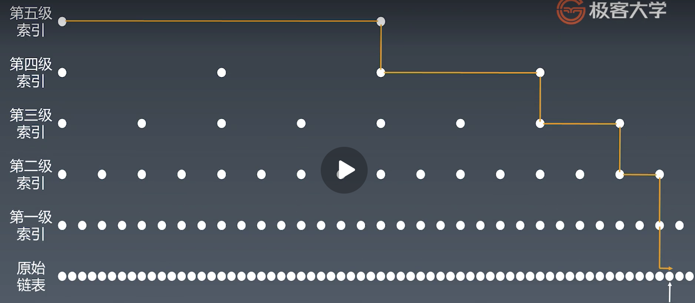

#### 学习总结

- 练习步骤
  1. 5-10 分钟： 读题和思考
  2. 有思路：自己开始做和写代码，不然，马上看题解
  3. 默写背诵，熟练
  4. 然后开始自己写（闭卷）

- 数组

  - [ArrayList](http://developer.classpath.org/doc/java/util/ArrayList-source.html)
    - 连续的内存空间
    - 可以随机访问任意一个元素
    - 访问的时间复杂度是O(1)
    - 插入删除的时间复杂度是O(n)  需要挪动元素
    - 初始容量是10 

- 链表

  - [LinkedList](http://developer.classpath.org/doc/java/util/LinkedList-source.html)

    - 不连续的内存空间

    - 访问元素都要从头去遍历元素 ，时间复杂度是O(n)

    - 添加结点和删除结点时间复杂度是O(1)

    - 每一个结点都包含一个 data,和一个 next指针（Node） 指向下一元素的位置

    - 只有一个指针的叫单链表，两个指针的叫双向链表，头指针用Head表示，尾指针用Tail表示，最后一个元素的next指向None,如果最后一个元素的next指向Head就叫循环链表

      

- 跳表

  - 弥补 链表 的缺陷而产生
  -  贯穿所有数据结构与算法的中心思想 务必记住
    - 升维度
    - 空间换时间
  - 跳表时间复杂度: 
    - 查询 O(logn) 索引高度: logn
    - 增删复杂度: O(logn)   （需要维护索引）
  - 工程中的应用　
    - [Redis](https://www.zhihu.com/question/20202931) 
    - [LRU缓存机制](https://leetcode-cn.com/problems/lru-cache/)
  - 

- 队列 （Queue）
  
    - 先入先出，添加删除时间复杂度都是O(1)
    - 查找的时间复杂度是O(n)  因为无序 所以查找需要遍历
    - 先来后到，公平性
    - 只用队列来做栈 或 只用栈来做队列
      那么你需要两个队列 或者 两个栈
      栈实现队列, 需要 A B 两个栈，出栈时 将 A 的元素全部转移至 B 栈，然后弹出 B 栈即可
- 栈 （Stack）    

    - 先入后出; 添加、删除皆为 O(1)
    - 查找的时间复杂度是O(n) 因为无序 所以查找需要遍历
    - 最近相关性 —> 用 栈 来解决
       现实情况用栈这种逻辑来解决，就能用栈来解决+
       工程里面有很多 从外向内、从内向外的扩散

- 优先队列 （ PriorityQueue ）

  - offer(E e)  将指定的元素插入到此优先级队列中

    ```java
       public boolean offer(E e) {
            if (e == null) // 如果 e== null 抛出空指针异常，所以PriorityQueue不能插入null元素
                throw new NullPointerException(); 
            modCount++; 
            int i = size;  //优先队列中的元素数量
            if (i >= queue.length)    //queue.length 队列的长度（也就是优先队列的容量） 如果队列中的元素数量大于队列的容量 进行自动扩容
                grow(i + 1); // 当前队列的元素小于64时，双倍扩容， 大于64时， 扩容50%
            size = i + 1;
            if (i == 0)
                queue[0] = e;
            else
                siftUp(i, e);
            return true;
        }
            int newCapacity = oldCapacity + ((oldCapacity < 64) ? (oldCapacity + 2) : (oldCapacity >> 1) );
    
    ```

    

  - 

- 